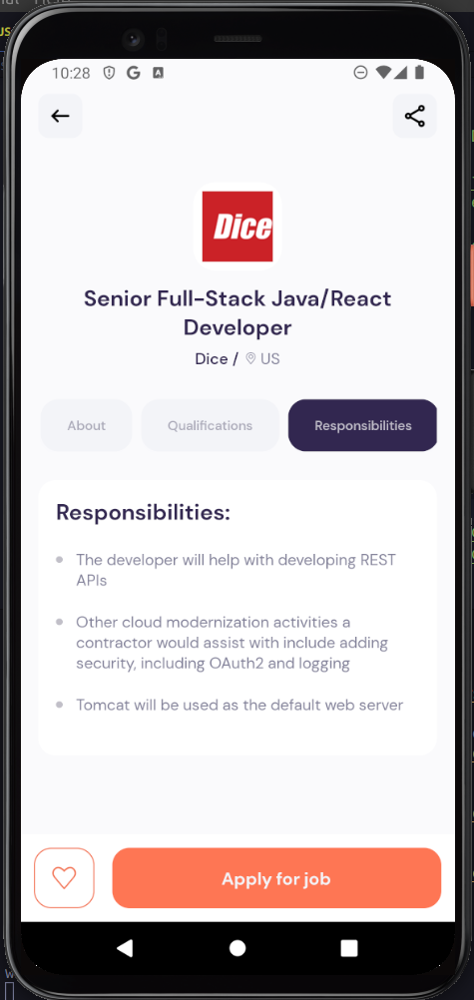

# Job Finder APP
A Job Finding App made with React Native, Axios. Users can search for any job coming from API and apply there.
<div align="center">
  <div style="display: flex; flex-wrap: wrap; gap: 16px">




  </div>
</div>
## <a name="tech-stack">⚙️ Tech Stack</a>

- Node.js
- React Native
- Axios
- Expo
- Stylesheet

## <a name="features">🔋 Features</a>

👉 **Visually Appealing UI/UX Design**: Develop an aesthetically pleasing user interface using React Native components.

👉 **Third Party API Integration**: Fetch data from an external API and seamlessly integrate it into the app.

👉 **Search & Pagination Functionality**: Implement search functionality and pagination for efficient data navigation.

👉 **Custom API Data Fetching Hooks**:Create custom hooks for streamlined and reusable API data fetching.

👉 **Dynamic Home Page**: Explore diverse jobs from popular and nearby locations across different categories.

👉 **Browse with Ease on Explore Page**: Page: Navigate through various jobs spanning different categories and types.

👉 **Detailed Job Insights**: View comprehensive job details, including application links, salary info, responsibilities, and qualifications.

👉 **Tailored Job Exploration**: Find jobs specific to a particular title 

👉 **Robust Loading and Error Management**: Ensure effective handling of loading processes and error scenarios. 

👉 **Optimized for All Devices**: A responsive design for a seamless user experience across various devices.

and many more, including code architecture and reusability
Use [`expo-router`](https://expo.github.io/router) to build native navigation using files in the `app/` directory.

## 🚀 How to use

```sh
npx create-expo-app -e with-router
```

